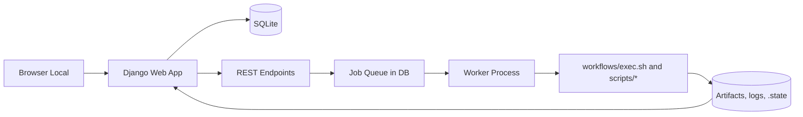

# Django Local Webapp Blueprint

## Objetivo

Transformar o pipeline atual em uma aplicacao web local com Django, mantendo os scripts existentes como motor de execucao e adicionando camada de orquestracao, monitoramento e controle por interface.

## Escopo Funcional

- Listar videos disponiveis para processamento.
- Exibir metadados por video: nome, duracao, idioma original inferido.
- Exibir status de execucao por arquivo e por etapa.
- Acionar scan manual para atualizar a lista.
- Selecionar arquivos por checkbox.
- Configurar opcoes de execucao por arquivo diretamente na linha da lista (dropdowns).
- Iniciar execucao em background para itens selecionados.
- Parar execucao em background para itens selecionados.
- Atualizar interface periodicamente sem recarregar pagina inteira.

## Principios de Implementacao

- Reusar scripts e workflows atuais sempre que possivel.
- Evitar reescrever logica de pipeline consolidada.
- Manter scripts bash como estao; a web apenas orquestra parametros.
- Eliminar interacoes de terminal no fluxo web (execucao 100% nao interativa).
- Incluir bootstrap operacional via scripts bash para setup e execucao local simplificados.
- Priorizar operacao local e simplicidade de deploy.
- Separar claramente:
  - camada web (Django)
  - camada de fila/worker
  - camada de execucao (scripts shell/python existentes)

## Arquitetura de Alto Nivel

## Componentes

### 1) Django Web App

Responsavel por:

- Renderizar a pagina principal com lista de videos.
- Renderizar controles de opcoes por arquivo (dropdowns) na lista.
- Expor endpoints para scan, run e stop.
- Expor endpoint de status para polling.
- Persistir estado em banco local.

### 2) Worker de Background

Responsavel por:

- Consumir jobs pendentes em fila.
- Iniciar subprocessos do pipeline por arquivo.
- Atualizar status de execucao durante processamento.
- Encerrar processos quando houver solicitacao de stop.

### 3) Adaptador de Pipeline

Responsavel por:

- Invocar fluxo existente em modo nao interativo.
- Mapear opcoes selecionadas na UI para flags do workflows/exec.sh.
- Aplicar regra de CUDA unica da UI para whisper e piper simultaneamente.
- Ler logs e estados para refletir progresso por etapa.
- Fazer reconciliacao de status em caso de restart da aplicacao.

### 4) Bootstrap Scripts (Bash)

Responsavel por:

- preparar ambiente local sem exigir conhecimento profundo de Django.
- executar setup inicial (venv, dependencias, migrate).
- iniciar servidor web e worker com comandos consistentes.

Scripts previstos:

- setup_webapp.sh
- start_webapp.sh
- stop_webapp.sh

## Mapeamento de Opcoes da UI para o Exec

Todas as opcoes disponiveis hoje no exec devem ser configuraveis pela UI.

Opcoes alvo:

- backend
- nllb-profile
- nllb-max-input-length
- nllb-max-new-tokens
- nllb-gpu
- nllb-legacy
- deepl-endpoint
- reset-deepl-keys-state
- normalize-dry-run
- cuda (unico na UI, mapeando para whisper-cuda e piper-cuda)

Regra de CUDA unificado:

- CUDA = Sim: enviar --whisper-cuda on e --piper-cuda on
- CUDA = Nao: enviar --whisper-cuda off e --piper-cuda off

## UX da Lista (Linha por Arquivo)

Cada linha da tabela deve ter:

- checkbox de selecao
- metadados (nome, duracao, idioma)
- status geral e por etapa
- painel de configuracao com dropdowns

Exemplo de dropdowns por linha:

- Backend: google | nllb_local | deepl_doc | gemini
- NLLB Profile: fast | legacy | custom
- NLLB GPU: on | off
- NLLB Legacy: on | off
- DeepL Endpoint: free | pro
- Reset DeepL Keys State: yes | no
- Normalize Dry Run: yes | no
- CUDA: yes | no (unificado)

## Fluxo de Uso

1. Usuario abre a pagina principal.
2. Clica em Scan.
3. Sistema varre diretorio configurado e atualiza tabela.
4. Usuario ajusta opcoes desejadas nos dropdowns de cada linha.
5. Usuario marca checkboxes.
6. Clica em Run para iniciar jobs em background, sem prompts interativos.
6. UI atualiza status com polling curto.
7. Usuario pode marcar itens em execucao e clicar Stop.
8. Worker encerra processos e atualiza estado final.

## Estados de Execucao

Estados recomendados para run por arquivo:

- discovered
- queued
- running
- stopping
- stopped
- success
- failed
- skipped

Etapas monitoradas:

- extract
- transcribe
- translate
- audiobook

Status por etapa:

- pending
- running
- success
- failed
- skipped

## Estrategia de Atualizacao da UI

MVP:

- Polling HTTP a cada 2-3 segundos.
- Atualizacao incremental da tabela com JSON.

Evolucao:

- Server-Sent Events para reduzir polling.

## Stop/Cancel Seguro

- Worker executa pipeline em grupo de processos.
- Stop envia SIGTERM para grupo.
- Aguarda grace period configuravel.
- Se ainda ativo, aplica SIGKILL.
- Marca run como stopped e registra motivo.

## Integracoes com Artefatos Atuais

- Configuracao de escopo: config/pipeline.ini
- Orquestrador principal: workflows/exec.sh
- Traducao DeepL com rotacao e fallback: workflows/translate_srt.sh
- Estados locais por video: .pipeline-state no data root
- Logs de execucao: logs sob data root

## Nao Objetivos no MVP

- Multiusuario e autenticacao.
- Deploy em nuvem.
- Escalonamento horizontal.
- Reescrita do pipeline para Celery distribuido.

## Criterios de Aceite do MVP

- Scan popula lista de videos com metadados basicos.
- Run inicia processamento em segundo plano para itens selecionados.
- Stop interrompe processamento de itens selecionados.
- Status geral e por etapa atualizam na interface sem reload completo.
- Reiniciar servidor web nao perde historico de runs no banco.
- Operacao local pode ser iniciada com scripts bash de bootstrap, sem passos manuais complexos de Django.
