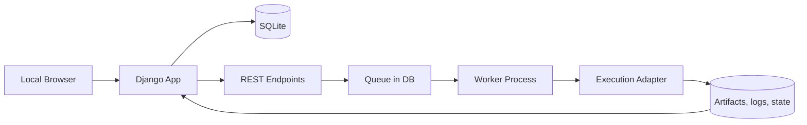

# Django Local Webapp Blueprint

## Goal

Provide a local Django web interface for scanning media assets, configuring per-file execution options, starting/stopping runs, and tracking status.

## Functional Scope

- List available video files.
- Display metadata per video (name, duration, inferred language).
- Display run status and step status.
- Trigger manual scan/refresh.
- Select multiple files using checkboxes.
- Configure per-file execution options directly in each row.
- Start runs in the background for selected items.
- Request stop for selected running items.
- Refresh status without full page reload.

## Implementation Principles

- Keep local-first operation and simple deployment.
- Reuse stable Python processing scripts where possible.
- Keep the web flow non-interactive.
- Separate concerns clearly:
  - web layer (Django views/API)
  - queue/worker layer
  - execution adapter layer

## Current Repository Alignment

- Legacy workflow shell wrappers were removed from `workflows/`.
- `workflows/webapp.sh` is kept for setup/start/stop/status lifecycle.
- The UI/worker should rely on maintained execution entrypoints only.

## High-Level Architecture

## Core Components

### 1) Django Web App

- Render the main file list page.
- Render per-row option controls.
- Expose scan/start/stop/status endpoints.
- Persist runtime state in local DB.

### 2) Background Worker

- Consume queued runs.
- Start subprocesses for per-file execution.
- Update run/step state.
- Handle stop requests safely.

### 3) Execution Adapter

- Build non-interactive command invocation.
- Map UI options to execution parameters.
- Parse logs for progress mapping.
- Reconcile stale states after app restarts.

### 4) Bootstrap Shell Scripts

- `scripts/webapp/setup_webapp.sh`
- `scripts/webapp/start_webapp.sh`
- `scripts/webapp/stop_webapp.sh`
- `scripts/webapp/status_webapp.sh`

## UI Option Mapping

Target per-row options:

- `backend`
- `nllb_profile`
- `nllb_max_input_length`
- `nllb_max_new_tokens`
- `nllb_legacy`
- `deepl_endpoint`
- unified CUDA switch (maps to the underlying execution mode settings)

## Row UX

Each table row should include:

- selection checkbox
- metadata (name, duration, language)
- global status + step chips
- execution options panel (dropdowns)

## Run States

Recommended run statuses:

- `discovered`
- `queued`
- `running`
- `stopping`
- `stopped`
- `success`
- `failed`
- `skipped`

Recommended step statuses:

- `pending`
- `running`
- `success`
- `failed`
- `skipped`

## UI Refresh Strategy

- MVP: short-interval HTTP polling.
- Future: optional Server-Sent Events.

## Safe Stop Strategy

- Run execution in process groups.
- Send `SIGTERM`, wait for grace period.
- Escalate to `SIGKILL` only when required.
- Persist stop reason and final state.

## MVP Acceptance Criteria

- Scan populates the list with basic metadata.
- Start enqueues selected items and worker consumes them.
- Stop requests are applied to selected active runs.
- Status updates on the UI without full reload.
- Restarting the web app does not lose DB run history.
